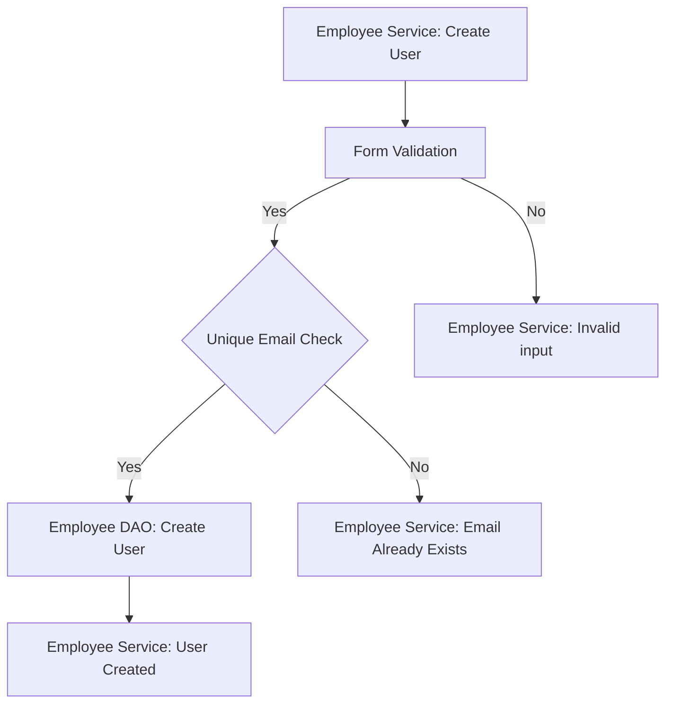
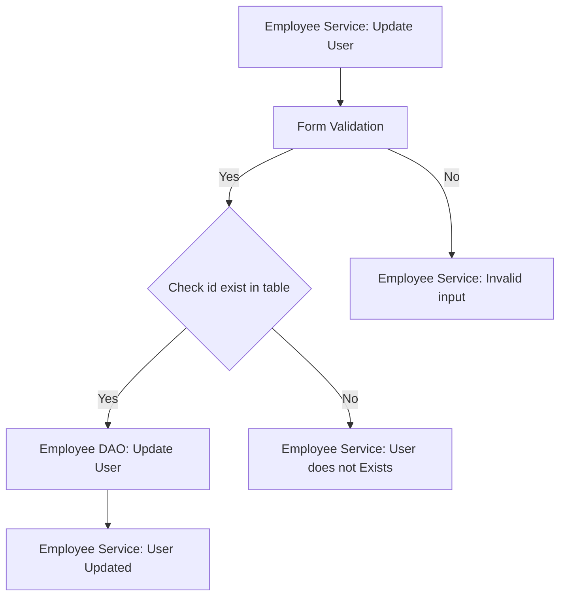
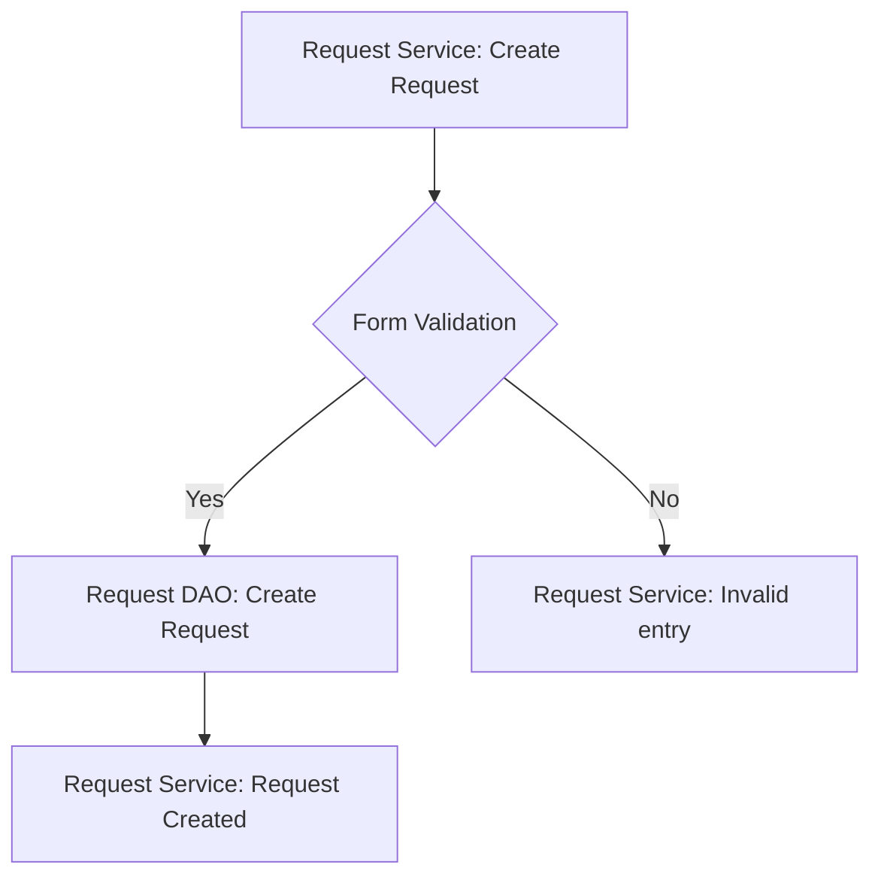
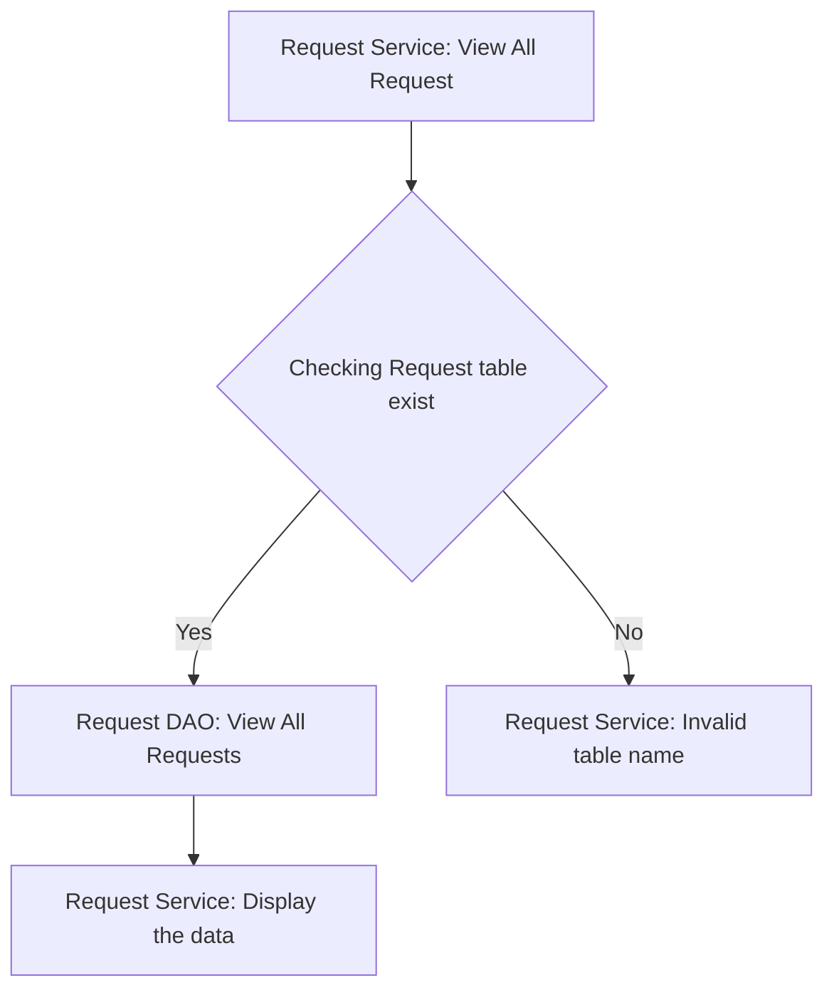
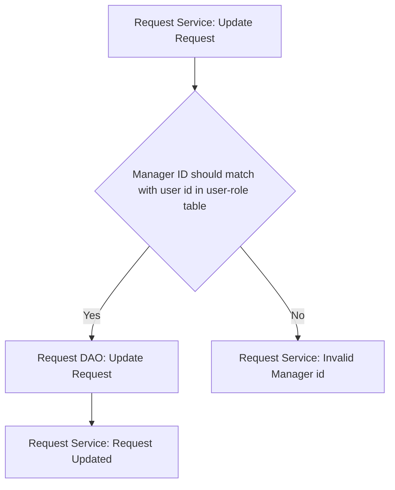

# LeavePulse Checklist

## Database Design

- [ ] Create an ER diagram of the database
- [ ] Write Create table scripts [script](path/to/ER/diagram)

## Project Setup

- [ ] Create a new Java project
- [ ] Set up a MySQL database
- [ ] Add necessary libraries
	- [ ] JDBC, 
	- [ ] MySQL Connector, 
	- [ ] JUnit, 
	- [ ] Dotenv

## Module: Employee
### Feature: Create Employee
#### User Story:
* User can create a new employee account

#### Pre-requisites:
- [ ] Create Roles table
- [ ] Create Employees table
- [ ] Create Employee-Role table
- [ ] Implement Employee model
- [ ] Implement Role model
- [ ] Implement Employee-Role model 
- [ ] Implement Role DAO (findAll, findById)
- [ ] Implement Employee DAO (create)
- [ ] Implements Employee-Role DAO (create)

#### Validations:
- [ ] Form Validation
	 * First Name (null, empty)
	 * Last Name (null, empty) 
	 * Email (Match email pattern)
	 * Phone Number(Match phone no pattern)
	 * Password (Must contain one lowercase, one uppercase, one number, one special character and length should be minimum 8 to maximum 24 characters)
	 * Address (null, empty)
- [ ] Business Validation
	* Email already exists

#### Messages:
* First Name cannot be nulll or empty
* Last Name cannot be null or empty
* Invalid Email id
* Invalid Phone Number
* Password should not match the pattern
* Address cannot be null or empty
* Email id already exist

#### Flow:

### Feature: Update Employee
#### User Story:
* User can update an existing employee account

#### Pre-requisites:
- [ ] Module 1 Feature 1
- [ ] Implement Employee DAO (update)

#### Validations:
- [ ] Form Validation
* First Name (null, empty)
 * Last Name (null, empty) 
 * Phone Number(Match phone no pattern)
 * Password (Must contain one lowercase, one uppercase, one number, one special character and length should be minimum 8 to maximum 24 characters)
 * Address (null, empty)
- [ ] Business Validation
* Only existing user details can be updated

#### Messages:
* First Name cannot be nulll or empty
* Last Name cannot be null or empty
* Invalid Phone Number
* Password should not match the pattern
* Address cannot be null or empty
* Invalid Email id

#### Flow:

## Module: Request
### Feature: Create Request
#### User Story:
* User can create a new request

#### Pre-requisites:
- [ ] Module 1 Feature 1
- [ ] Create Leave-Type table
- [ ] Implement Leave-Type model
- [ ] Implement Leave-Type DAO (findAll, findById)
- [ ] Create Request table
- [ ] Implement Request model 
- [ ] Implement Request DAO (create)

#### Validations:
- [ ] Form Validation
* Start date (greater than or equal to today)
* End date (greater than or equal to start date)

#### Messages:
* Start date should be greater than or equal to today
* End date should be greater than or equal to start date

#### Flow:

### Feature: View All Requests
#### User Story:
* User can see all request

#### Pre-requisites:
- [ ] Module 2 Feature 1
- [ ] Implement Request DAO (viewAll)

#### Validations:
- [ ] Business Validation
* Request table must be already exist

#### Messages:
* Table not Found

#### Flow:

### Feature: Update Request
#### User Story:
* User can update an existing request

#### Pre-requisites:
- [ ] Module 2 Feature 1
- [ ] Module 2 Feature 2
- [ ] Implement Request DAO (update)

#### Validations:
- [ ] Business Validation
* Only existing request can be updated
* Only the manager of the employee can update the request

#### Flow:

